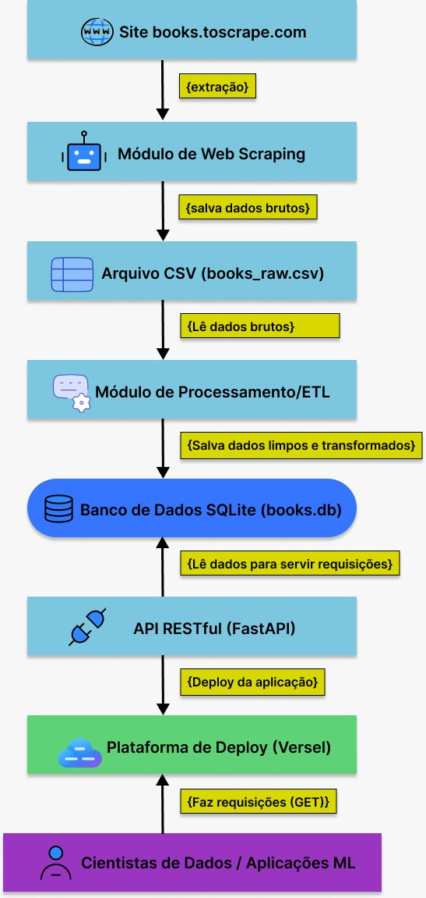
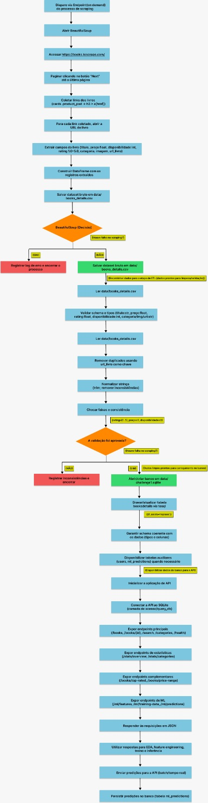
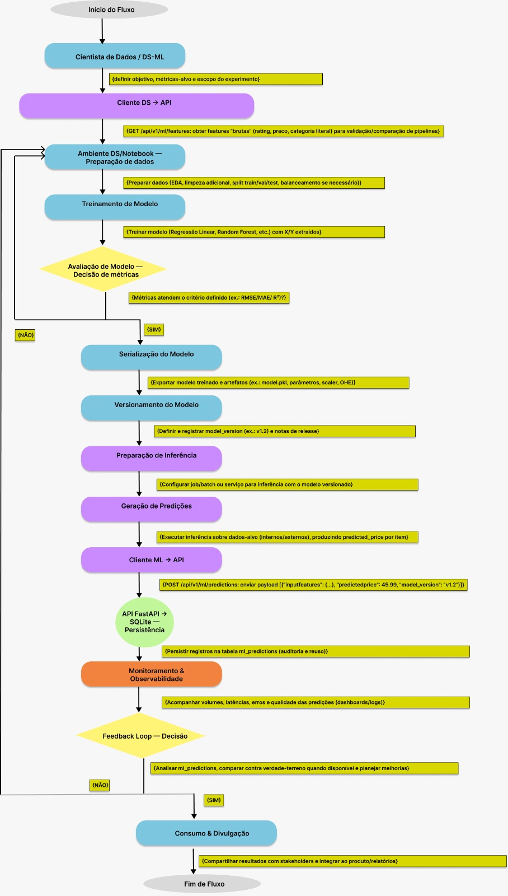

# Books API — Tech Challenge (Fase 1)

## Utilização

Link do deploy: https://tech-challenge-1-mle.onrender.com/

Link do Streamlit: https://techchallenge1mle-logdechamadas.streamlit.app/

## Demonstração

Link da demonstraçao: https://www.youtube.com/watch?v=MXKybMZ67No&feature=youtu.be

## Visão geral do projeto

Este repositório implementa um pipeline completo para disponibilizar dados de livros por meio de uma API pública, simulando um cenário real de construção de uma base para \*\*recomendações de livros\*\*. O fluxo contempla:


- \*\*Ingestão (on demand)\*\* por scraping do site fonte.

- \*\*Processamento/ETL\*\* com validações e normalizações.

- \*\*Armazenamento\*\* em \*\*SQLite\*\*.

- \*\*API REST (FastAPI)\*\* com endpoints Core, Insights e ML-Ready.

- \*\*Consumo\*\* por cientistas de dados e aplicações de ML.


> O objetivo é garantir uma base consistente para consumo analítico e treinamento de modelos, com foco em escalabilidade e reuso.


---


## Arquitetura (alto nível)


- Fonte: https://books.toscrape.com/

- Scraper (Selenium) → CSV: `data/books\_details.csv`

- ETL (validação/limpeza) → SQLite: `data/challenge1.sqlite` (tabela `books\_details`)

- API (FastAPI) → Endpoints Core/Insights/ML/Auth

- Consumidores (DS/ML): recebem JSON; predições são persistidas via `/api/v1/ml/predictions`


> Tabelas auxiliares geridas pela API: `users`, `ml\_predictions`.


## Diagrama




## Estrutura recomendada de pastas


```

.

├─ data/

│  ├─ books\_details.csv

│  └─ challenge1.sqlite

├─ notebooks/

│  ├─ bookstoscrape\_Scraper.ipynb

│  ├─ exploratory\_data\_analysis.ipynb

│  └─ model\_pipeline.ipynb

├─ main.py

├─ auth.py

├─ db\_usuarios.py

├─ requirements.txt (recomendado)

└─ README.md

```

## Fluxo detalhado 



 ## Fluxo Machine Learning detalhado



## Pipeline de dados

### 1) Ingestão (Scraping)

- Notebook: `notebooks/bookstoscrape\_Scraper.ipynb`

- Acessa `https://books.toscrape.com/`

- Paginação por `.next`

- Coleta links dos livros (cards `.product\_pod → h3 > a\[href]`)

- Para cada livro, extrai:

  - `titulo` (h1.text)

  - `preço` (string “£..” → float)

  - `rating` (classe em `p.star-rating` → mapeamento One..Five → 1.0..5.0)

  - `disponibilidade` (regex de dígitos em “In stock (N available)” → int)

  - `categoria`, `imagem` (URL absoluta), `url\_livro` (href da página)

- Gera CSV em `data/books\_details.csv`

# 

### 2) ETL (validação/limpeza)

- Leitura: `data/books\_details.csv`

- Validações recomendadas:

- Schema e tipos:

  - `titulo:str`, `preço:float`, `rating:float (1.0–5.0)`, `disponibilidade:int (>=0)`, `categoria:str`, `imagem:str`, `url\_livro:str`

- Deduplicação por `url\_livro`

- Normalização (trim) e checagem de faixas (`preço >= 0`, `rating ∈ \[1..5]`)

- Carga: grava no SQLite `data/challenge1.sqlite`, tabela `books\_details`

- No notebook: `df.to\_sql('books\_details', conn, if\_exists='replace', index=False)`

# ---


## Executando a API


## Banco de dados

# 

- Caminho: `data/challenge1.sqlite` (conforme `main.py`)

- Tabelas utilizadas:

- `books\_details`: fonte principal para os endpoints Core/Insights/ML

- `users`: criada por `/add\_user` (auth)

- `ml\_predictions`: criada por `/api/v1/ml/predictions` (persistência de predições)

# ---

# 

## Documentação das rotas (com exemplos)

# 

- GET `/` 

- Exemplo:

  - Request: `curl tech-challenge-1-mle.onrender.com`

  - Response: `{"message":"Hello, FastAPI!"}`

# 

- GET `/api/v1/health`

- Verifica acesso ao SQLite e conta registros.

- Exemplo:

  - Request: `curl tech-challenge-1-mle.onrender.com/api/v1/health`

  - Response (ex.): `{"status":"ok","total\_livros": 1000}`

# 

### Core

- GET `/api/v1/books`

- Retorna livros com disponibilidade > 0 (campos: `titulo`).

- Exemplo:

  - Request: `curl tech-challenge-1-mle.onrender.com/api/v1/books`

  - Response (ex.): `{"livros\_disponiveis":\[{"titulo":"A Light in the Attic"}, ...]}`

# 

- GET `/api/v1/books/{id:int}`

- Retorna o registro completo por `rowid`.

- Exemplo:

  - Request: `curl tech-challenge-1-mle.onrender.com/api/v1/books/1`

  - Response (ex.): 

    ```

    {

      "ID": 1,

      "titulo": "...",

      "preço": 51.77,

      "rating": 3.0,

      "disponibilidade": 22,

      "categoria": "Poetry",

      "imagem": "https://...",

      "url\_livro": "https://..."

    }

    ```

# 

- GET `/api/v1/books/search?title\&category`

- Busca por `titulo` e/ou `categoria` (LIKE).

- Exemplo:

  - Request: `curl "tech-challenge-1-mle.onrender.com/api/v1/books/search?title=light\&category=Poetry"`

  - Response (ex.): `{"resultado":\[{"ID":1,"titulo":"A Light in the Attic","categoria":"Poetry","disponibilidade":22}]}`

# 

- GET `/api/v1/categories`

- Lista categorias com disponibilidade > 0.

- Exemplo:

  - Request: `curl tech-challenge-1-mle.onrender.com/api/v1/categories`

  - Response (ex.): `{"Categorias\_disponiveis":\[{"categoria":"Poetry"}, {"categoria":"Fiction"}, ...]}`

# 

### Insights

- GET `/api/v1/stats/overview`

- Retorna: total de livros, preço médio, distribuição de ratings.

- Exemplo:

  - Request: `curl tech-challenge-1-mle.onrender.com/api/v1/stats/overview`

  - Response (ex.): 

    ```

    {

      "total\_livros": 1000,

      "preco\_medio": 35.77,

      "distribuicao\_ratings": \[{"rating":5.0,"total":200}, ...]

    }

    ```

# 

- GET `/api/v1/stats/categories`

- Retorna, por categoria: quantidade, preço médio, min, max.

- Exemplo:

  - Request: `curl tech-challenge-1-mle.onrender.com/api/v1/stats/categories`

  - Response (ex.):

    ```

    {

      "categorias":\[

        {"categoria":"Poetry","quantidade":20,"preco\_medio":31.2,"preco\_min":10.5,"preco\_max":55.0}

      ]

    }

    ```

# 

### Extras

- GET `/api/v1/books/top-rated?limit=10`

- Retorna livros com `rating = 5` (corte em memória pelo `limit`).

- Exemplo:

  - Request: `curl "tech-challenge-1-mle.onrender.com/api/v1/books/top-rated?limit=5"`

  - Response (ex.): `{"top\_rated\_books":\[{"titulo":"Sapiens...", "categoria":"History", "rating":5.0}, ...]}`

# 

- GET `/api/v1/books/price-range?min=10\&max=30`

- Filtra em memória por faixa de preço.

- Exemplo:

  - Request: `curl "tech-challenge-1-mle.onrender.com/api/v1/books/price-range?min=10\&max=30"`

  - Response (ex.):

    ```

    {

      "livros\_filtrados":\[

        {"titulo":"The Requiem Red","categoria":"Young Adult","preço":22.65,"disponibilidade":"19"}

      ]

    }

    ```

# 

### ML-Ready

- GET `/api/v1/ml/features`

- Retorna features numéricas limpas de `rating`, `preco`, com `categoria` e `disponibilidade`.

- Exemplo:

  - Request: `curl http://tech-challenge-1-mle.onrender.com/api/v1/ml/features`

  - Response (ex.):

    ```

    {

      "features\_data":\[{"titulo":"...","rating":4.0,"preco":47.82,"categoria":"Mystery","disponibilidade":20}],

      "total\_registros": 980

    }

    ```

# 

- GET `/api/v1/ml/training-data`

- Retorna dataset pronto para treino com \*\*OHE\*\* de `categoria`:

  - `X\_rating` (float)

  - `X\_categoria\_ohe` (vetor binário)

  - `Y\_preco` (float)

  - `one\_hot\_encoding\_map` (ordem das categorias)

- Exemplo:

  - Request: `curl http://tech-challenge-1-mle.onrender.com/api/v1/ml/training-data`

  - Response (ex.):

    ```

    {

      "training\_data":\[{"X\_rating":4.0,"X\_categoria\_ohe":\[0,1,0,...],"Y\_preco":47.82}],

      "total\_samples": 980,

      "one\_hot\_encoding\_map": \["Poetry","Mystery","History", ...]

    }

    ```

# 

- POST `/api/v1/ml/predictions`

- Persiste predições em `ml\_predictions`.

- Body (JSON, lista de objetos):

  ```

  \[

    {

      "predicted\_price": 39.9,

      "input\_features": {"rating":4.0,"categoria":"Mystery"},

      "model\_version": "v1.0.0"

    }

  ]

  ```

- Exemplo:

  - Request:

    ```

    curl -X POST http://tech-challenge-1-mle.onrender.com/api/v1/ml/predictions \\

      -H "Content-Type: application/json" \\

      -d '\[{"predicted\_price":39.9,"input\_features":{"rating":4.0,"categoria":"Mystery"},"model\_version":"v1.0.0"}]'

    ```

  - Response (ex.):

    ```

    {"message":"Sucesso ao receber e armazenar 1 de 1 predições no SQLite.","status":"stored\_ok"}

    ```

# 

### Autenticação (bônus)

- POST `/add\_user`

- Cria tabela `users` se não existir e insere usuário com senha hasheada.

- Body (JSON):

  ```

  {"username":"admin","password":"s3cr3t"}

  ```

- Exemplo:

  - Request:

    ```

    curl -X POST http://tech-challenge-1-mle.onrender.com/add\_user \\

      -H "Content-Type: application/json" \\

      -d '{"username":"admin","password":"s3cr3t"}'

    ```

  - Response (ex.): `{"message":"Usuário admin criado com sucesso!"}`

# 

- POST `/api/v1/auth/login`

- Retorna JWT (OAuth2PasswordRequestForm).

- Exemplo:

  - Request:

    ```

    curl -X POST http://tech-challenge-1-mle.onrender.com/api/v1/auth/login \\

      -H "Content-Type: application/x-www-form-urlencoded" \\

      -d "username=admin\&password=s3cr3t"

    ```

  - Response (ex.):

    ```

    {"access\_token":"<JWT>", "token\_type":"bearer"}

    ```

# 

- POST `/api/v1/auth/refresh`

- Renova token (header Authorization: Bearer <token>).

- Exemplo:

  - Request:

    ```

    curl -X POST http://tech-challenge-1-mle.onrender.com/api/v1/auth/refresh \\

      -H "Authorization: Bearer <JWT>"

    ```

  - Response (ex.):

    ```

    {"access\_token":"<NEW\_JWT>", "token\_type":"bearer"}

    ```


# ---

# 
